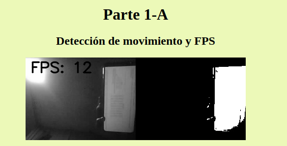

# **Práctica 2**

### **Integrantes**
* Henry Tacuri
* Franklin Guapisaca

### **Ejucución de las aplicaciones**

* Para ejecutar la parte 1 utilizamos el comando **flask --app app run**

* Para ejecutar la parte 2 utilizamos el comando **flask --app app2 run**

### **La parte 1 se puede ejecutar por partes para evitar los problemas de lentitud del video**

Por ejemplo para ejecutar los problemas de iluminación se quitaría el comentario de la respectiva línea y el resto de líneas se comentarían.

# **Parte 1-A**

**Detección de movimiento y FPS**

* Primer video: Video original a escala de grises y FPS.
* Segundo video:  Detección de movimiento.

Para la detección de movimiento utilizamos la técnica **Adaptive Background Substraction**, esta técnica lo que hace es combinar las técnicas **Background Substraction** y **Frame Differencing**, con lo cuál se obtiene lo mejor de las dos ya que se emplea una tasa de aprendizaje λ. Se realiza la ponderación del fondo anterior y de la imagen entrante para lograr construir un nuevo fondo. Por ejemplo, cuando la tasa de aprendizaje es 0.1 pasan 10 fps antes de actualizar la imagen de fondo, si la tasa de aprendizaje es más pequeña entonces la actualización del fondo será más rápida. La actualización del fondo es lo que nos permite detectar el movimiento.

Para calcular los FPS hacemos uso del método **time()**.

**Problemas de iluminación**

* Primer video: Video original a escala de grises.
* Segundo video:  ecualización de histograma.
* Tercer video: Método CLAHE.
* Cuarto video: Ajuste gamma.

**Explicación del ajuste gamma**

El **Ajuste gamma** consiste en modificar el contraste y el brillo de una imagen o video. Con esta técnica corregimos la curva de la respuesta gamma, la cual es la representación de la luz en una imagen. La corrección gamma nos permite ajustar la relación entre el valor de píxel en la imagen y la cantidad de luz que realmente representa, por lo que se aplicaca una función matemática a los valores de los pixeles de la imagen para lograr modificar su brillo.

Cuando el valor de gamma es mayor que 1, entonces la imagen se oscurece, esto es debido a que la relación de la luminancia y el valor del pixel es más pronunciada, con lo cual los valores más bajos de los pixeles, se hacen más oscuros.

Cuando el valor de gamma es menor que 1, entonces las áreas oscuras de la imagen se iluminan más y las áreas claras de la imagen no tienen ninguna modificación.

El ajuste gamma no es lineal debido a que se ajustan los valores de los píxeles de la imagen con una función exponencial para poder ver el constrarte y el brillo de la imagen de una manera más natural.

Lo que hacemos en este codigo es primero calcular el inverso de gamma **(inv_gamma)**, para determinar como se ajustará el brillo, en este caso gamma vale 1.5.

Luego generamos una tabla de 256 valores (valores de los pixeles) donde aplicamos la corrección corrección gamma. Normalizamos el valor del pixel en un rango de 0 y 1 **(i / 255.0) ** inv_gamma**, luego se eleva a la potencia del inverso de gamma y por último lo escalamos a **0 - 255** para logar tener el valor del pixel ajustado.

Para aplicar la tabla de transformaciones a la imagen gray (FPS a blanco y negro) hacemos uso de la función **cv2.LUT**, la cuál toma la imagen de entrada para mapear los valores de sus pixeles con los valores de la tabla creada enteriormente.

Las dos primeras líneas de código son empleadas antes de capaturar los FPS del video.

# **Parte 1-B**

**Filtro de sal y pimienta**

* Primer video: Video original a escala de grises.
* Segundo video:  Filtro de sal y pimienta.
* Tercer video: Filtro de la mediana.
* Cuarto video: Filtro blur.
* Quinto video: Filtro Gaussiano.

El mejor filtro para reducir el ruido de sal y pimienta ha sido el **filtro de la mediana**, mientras que los filtros blur y gaussiano han generado una imagen con desenfoque y con suavidado respectivamente.

El filtro de la mediana tiene mejores resultado debido a que toma el vecindario de un pixel, y para ese pixel reemplaza el valor mediano del vecindario, lo que permite eliminar de manera eficativa el ruido de sal y pimienta que son los pixeles con valores de 255 y 0, mientras que los filtros **blur** y **gaussiano** calculan el promedio de los valores de los pixeles del vecindario. Por lo que, si hay un píxel con ruido de sal y pimienta, entonces ese valor afectará el promedio. Por lo tanto los píxeles que tienen valores razonables pueden ser distorsionados o suavizados, lo que ocasina que el ruido de sal y pimienta no pueda ser reducido.

Sin embargo cuando hay demasiado ruido de sal y pimienta, entonces no se puede reducir el ruido completamente.

**Detección de bordes**

Para poder mejorar la detección de bordes se aplicó el ajuste gamma para poder resolver los problemas de iluminación.

**Primera fila de imágenes**

* Primer video: Video original a escala de grises.
* Segundo video:  Filtro de suavizado suavizado (Filtro gaussiano).
* Tercer video: Algoritmo de sobel.
* Cuarto video: Algoritmo de canny.

**Para la segunda fila de imágenes tenemos lo mismo pero sin filtro de suavizado**

Cuando se hace uso de los filtros de suavizado no es tan bueno el resultado, debido que cuando se suaviza la imagen los bordes no se pueden detectar correctamente debido a que el suavizado elimina detalles finos de los bordes, es decir que los bordes ya no están tan definidos. Por otro lado, cuando no se aplican filtros de suavizado, se pueden detectar los bordes de mejor manera.

# **Parte 2**

**Operaciones Morfológicas**

El orden de las imágenes es: Imagen original, Erosión, Dilatación, Top Hat, Black Hat.

En la fila 1 está la primera imagen, en la fila dos la segunda imagen y en la fila 3 la tercera imagen.

Cuando aplicamos las operaciones de erosión y dilatación podemos observar que las imágenes tienen una mejora pequeña en su nitidez.

Cuando aplicamo las operación de Top Hat, las áreas de alto contraste son más resaltadas, lo que nos permite tener una mejor visualización de detalles claros en el contexto de fondo oscuro, lo que nos ayuda a resaltar de mejor manera los bordes y los contornos, y como se puede observar se resaltan de mejor manera los huesos.

Cuando aplicamos la operación de Black Hat, se resaltan de mejor manera las áreas oscuras, lo que facilita la detección de objetos en las áreas con sombras, pero también da paso a que se puedan oscurecer áreas brillantes. Como se puede observar las áreas oscuras tienen una mejor claridad.

Cuando aplicamos la operación **Imagen Original + (Top Hat – Black Hat)**, hay una mejora total en la imagen, ya que se pueden ve la imagen con mejor nitidez y los objetos (huesos) son apreciados de mejor manera, esto es debido a que el contraste es aumentado en las áreas donde había poco, por lo que los detalles brillantes y los detalles los oscuros son más visibles, también se mantiene la información de la imagen original debido a que los detalles son resaltados pero no son modificados drásticamente. También como se puede observar se resaltan los bordes y contornos sin generar mucho ruido.

Hay que tener en cuenta que cuando se aplica una máscara demasiado superior a 37X37 se tiene un mayor suavizado de la imagen lo que hace que las estructuras estén menos definidas, también esto genera una perdida de contraste en ciertas áreas de la imagen. Por otro lado cuando se aplica una máscara demasiado inferior a 37X37 la imagen tiene una mayor nitidez en los detalles muy finos, pero esto da paso a una perdida de claridad en las estructuras más gruesas, lo que puede dar paso a que los detalles que no son tan importantes sean vistos de mejor manera.
